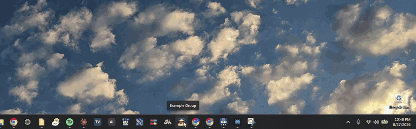
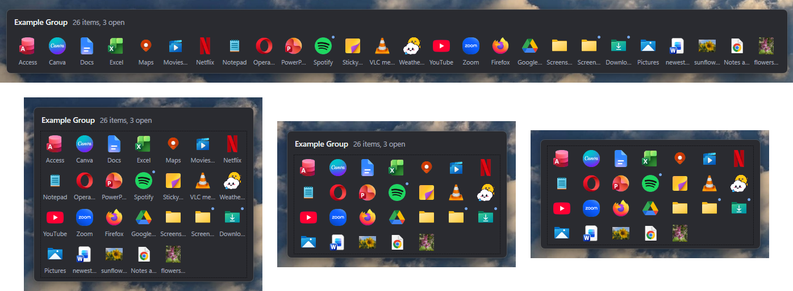
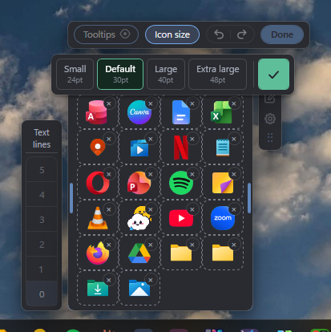
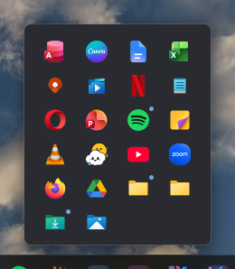
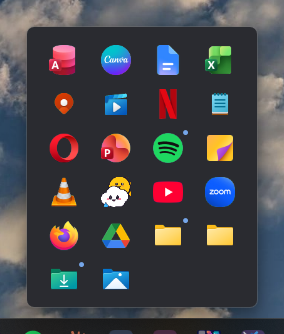
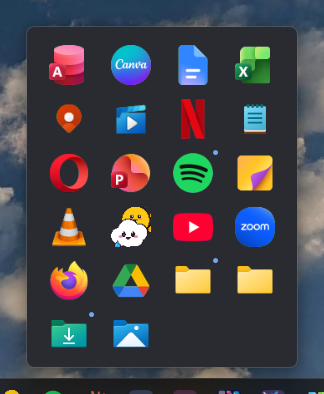
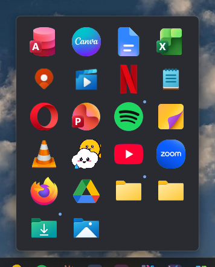
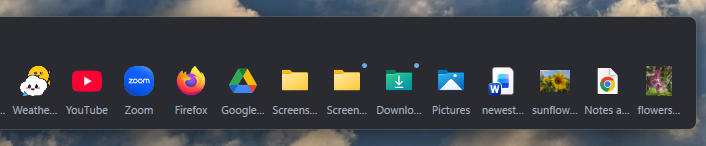
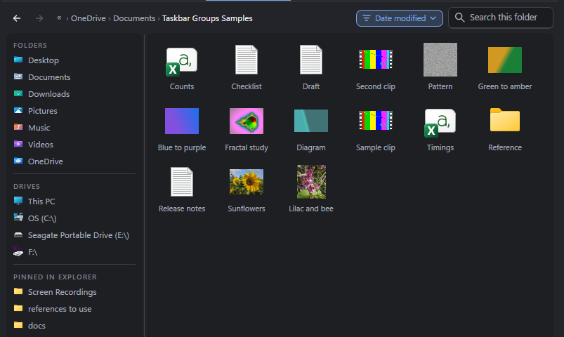
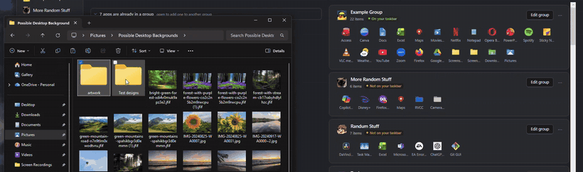

  

<h1 align="center">Taskbar App Groups</h1>

  Fold a crowded Windows 11 taskbar into a few group icons.  Click one, and the apps inside fan out with live previews of their windows.

  
  
  
  
  

  <a href="../../releases/latest"><b>Download for Windows 11</b></a>
  &nbsp;&middot;&nbsp;
  <a href="../../releases">Release notes</a>

  One file, about 49 MB. No .NET to install, no account, no telemetry.

  

  One click on a group icon. Recorded on a real Windows 11 taskbar.

---

## What it is for

Windows 11 gives you one row for pinned apps and no folders. Pin everything you use and the row runs out of taskbar; pin only a few and the rest live in the Start menu, two clicks away.

This app puts them in groups. A group is one icon on your taskbar, and behind it is a small panel holding the apps you put in it. A group can hold folders and documents as well as apps, and you decide what shape the panel is.

Nothing is replaced and nothing is patched: a group is an ordinary Windows shortcut with an icon of its own, so the taskbar treats it like any other pinned app.

---

## Everything you have, ready to drag

This is the whole of using it. Every app on your taskbar and every app installed on the machine, found for you and searchable, packaged apps and ordinary programs alike. Nothing to hunt down and no paths to type.

Select what you want, with Ctrl or Shift for several at once, and drag them across as one stack. A run of apps lands in the order it was in, wherever you point it, and **anything you change here is easy to undo**.

  

---

## Every group gets a face

Templates and a free hand designer. These are real group icons off a real taskbar, composed at the size Windows asks for:

<table>
<tr>
<td align="center"></td>
<td align="center"></td>
<td align="center"></td>
<td align="center"></td>
<td align="center"></td>
<td align="center"></td>
<td align="center"></td>
<td align="center"></td>
</tr>
<tr>
<td align="center"><b>Text only</b></td>
<td align="center"><b>App grid</b></td>
<td align="center"><b>Grid plus text</b></td>
<td align="center"><b>One app</b></td>
<td align="center"><b>Your image</b></td>
<td align="center"><b>Your own design</b></td>
<td align="center"><b>Your own design</b></td>
<td align="center"><b>Your own design</b></td>
</tr>
</table>

Real group icons off one taskbar, composed by the app at the size Windows asks for. Nothing here was drawn for the screenshot.

---

## Shape the flyout, from inside the flyout

A flyout used to be one row, always. Now it is whatever shape you want, and you change it by editing the real thing rather than a picture of it.

Open a group, press the pen, and the flyout itself becomes editable in place.

  

  The same group, reshaped by dragging its edge. Nothing opens, nothing is saved, and Esc puts it back.

<table>
<tr>
<td width="52%" valign="top">

**Drag an edge and the grid reflows.** One row becomes two, or five. You are dragging tiles into place rather than stretching a box, so the flyout only ever holds whole rows and never has empty space in it.

**Names, from five lines down to none.** A column of choices sits beside the flyout while you edit, and the lowest is **No names**: clean icons and nothing else.

**Hide the group's name, or type a new one** straight into the flyout.

**Tooltips on or off**, so a group can be as quiet as you like.

**Rearrange the apps** by dragging them, and take one out with the badge on its corner.

**Undo and redo the whole time.** Enter or Done keeps the shape. **Esc puts it back exactly as it was.**

</td>
<td width="48%"></td>
</tr>
</table>

Every one of those is a global setting with a per group override, so your groups can all match, or each one can be its own thing. Where a flyout opens is yours too: centred on its button, lined up on its left hand app, or lined up on its right hand app.

---

## Change icon size

The apps in a flyout are drawn at four sizes, and the name follows the icon rather than being a second setting to keep in step. Pick one while the flyout is open and it changes in front of you, at the size it will really be, on the group you are really looking at.

  

  Press <b>Icon size</b> while editing a flyout. Every choice previews in place. The tick keeps it, Esc puts it back.

 

<table>
<tr>
<td align="center" valign="bottom"></td>
<td align="center" valign="bottom"></td>
<td align="center" valign="bottom"></td>
<td align="center" valign="bottom"></td>
</tr>
<tr>
<td align="center"><b>Small</b> 24pt</td>
<td align="center"><b>Default</b> 30pt</td>
<td align="center"><b>Large</b> 40pt</td>
<td align="center"><b>Extra large</b> 48pt</td>
</tr>
</table>

  One group, drawn four ways, shown at true relative scale.

<table>
<tr>
<td width="50%" valign="top">

**Four sizes, a button each.** Press one to pick between them, with no slider to nudge into place.

**The name follows the icon.** 10, 11, 12 and 13 point under 24, 30, 40 and 48, so a bigger icon never ends up with tiny writing under it.

</td>
<td width="50%" valign="top">

**Global, or per group.** Set it once for everything, or give one group a size of its own and leave the rest alone.

**Nothing moves unless you move it.** A flyout you have never told is drawn at exactly the size it always was.

</td>
</tr>
</table>

---

## Not only apps: folders and files

A group can hold a mix of apps, folders and documents. Click a folder and Explorer opens it; click a document and it opens in whatever normally opens it. There is nothing special about them once they are in, which is the point.

  

<table>
<tr>
<td width="48%"></td>
<td width="52%" valign="top">

### A file browser built in

A third tab alongside your taskbar apps and everything installed. Quick access down the side with your standard folders, OneDrive, This PC and whatever Windows itself has pinned. A breadcrumb, a back arrow, search, headings you can sort by, columns you can drag wider, and a list or tiles at four sizes.

**Files draw their real picture**, the same thumbnail Explorer shows, and a video gets a strip of frames taken from inside it.

</td>
</tr>

<tr>
<td width="52%" valign="top">

### Or straight out of Explorer

Drag a file or a folder off a real Explorer window, or off your desktop, and drop it into a group. The same three places that already take a dragged app take a dragged file: a group's card, a group's own page, and the flyout itself.

Pick several with Ctrl or Shift and they travel together, and one drag is one press of Ctrl+Z.

</td>
<td width="48%"></td>
</tr>
</table>

---

## What it does

<table>
<tr>
<td width="46%" valign="top">

### Live window previews

Hover an app that has windows open and you get a preview of each one, drawn by the same part of Windows the taskbar's own previews use. The title, the app's icon, and a close button on every one.

</td>
<td width="54%"></td>
</tr>

<tr>
<td width="46%"></td>
<td width="54%" valign="top">

### Peek at the real window

Rest on a preview and the window itself comes forward, full size, in its own place, over everything else. Move away and it goes back exactly as it was. Nothing is activated and nothing is resized. Off until you switch it on.

</td>
</tr>

<tr>
<td width="46%" valign="top">

### Draw the icon yourself

A real editor: layers of text, shapes, app icons and pictures, dragged around, resized by their corners, turned by a handle, in any colour, at any weight. Sixty steps of undo, and the 16, 24, 32 and 48 pixel versions drawn underneath as you work.

</td>
<td width="54%"></td>
</tr>

<tr>
<td width="46%" valign="top">

### Change any app's icon

The same designer will rewrite the icon of an app that is not in any group, so your Start menu and taskbar show your picture instead of theirs. It says up front which apps Windows will allow this for, and it can put the original back exactly.

</td>
<td width="54%"></td>
</tr>

<tr>
<td width="46%"></td>
<td width="54%" valign="top">

### Light, dark, and your call on everything

**There is a full light theme and a full dark one**, and it will follow Windows if you would rather not choose. Every screenshot on this page is the dark theme; the light one is the same app in daylight. Then: how many rows a flyout has and how many lines a name gets, whether it opens centred on its button or lined up on an app, what the other previews do when you close one, whether it starts with Windows. Every setting shows you a picture of what it does rather than describing it.

</td>
</tr>
</table>

---

## Making your first group

### 1. Drag some apps in

Everything on your taskbar and everything installed, searchable, plus a folders and files tab for anything else. Drag them across, or use the button.

  

### 2. Give it a face

Pick a template, drop in a picture, or open the designer and draw one.

  

### 3. Pin it

Save, and a small window holds your group's icon. **Drag it out of that window onto your taskbar**, where you want it to sit. If you would rather go through the shortcuts folder, there is a setting for that, and right click and **Pin to taskbar** works from there too.

  

> [!WARNING]
> **One thing is by hand, and it has to be.** Windows 11 does not let any program pin or unpin a taskbar button, so the last step is yours: drag the group onto your taskbar, then unpin the apps you have just grouped. The app names exactly which icons to remove and reminds you on the way out.

---

## Performance and optimization

It is built to sit out of your way. Measured with the app's own instruments and with Windows' own process counters, and every number below is reproducible.

| | |
|---|---|
| Sitting in the background, nothing on screen | **No measurable CPU.** A measured zero over four separate minutes, before and after opening groups |
| Memory, in that state | **About 77 MB**, and about 125 MB once you have opened your groups |
| Opening a group of 14 apps | **About 120 to 150 ms** |
| Opening a group of 6 | About 110 to 130 ms |
| Background services | **None.** No service and no scheduled task |
| Added to your startup | **Nothing**, unless you switch that on yourself |
| Network | One update check a day, and nothing else |

**Nothing ticks while no flyout is on screen.** The timers that keep previews and running dots current only run while there is a flyout to keep current.

The detail, including what it does cost

- **A flyout left open on screen costs about 1% of one core** for as long as you leave it up, because it is a live thing refreshing what it shows.
- **Memory grows as you use it and then stops.** Every app icon is read out of Windows once and kept, about 160 KB each, which is why the second time you open a group it is instant. It does not hand that back while it is running, and that is deliberate: giving it back would mean re-reading the icons on your next click. Close the app if you want the memory.
- **The first click after signing in takes one to three seconds**, and almost all of that is Windows starting the program rather than anything this app does. Turning on "start with Windows" moves that cost to sign-in: measured at 426 ms without it and 232 ms with it, on a group of 14.
- **A very large group costs more.** 221 apps in one group opens in 285 to 340 ms rather than 120 to 150.
- **The memory figures come from a heavy setup**: 13 groups, 446 apps and folders between them, and 230 pictures read in at sign-in. A handful of groups costs less than that.
- Measured on an Intel Core i7-1165G7, 16 GB, Windows 11 Home, at 100% scaling, on a debug build, which is the slower of the two. A release build was measured against the same workload and was not faster, so none of these numbers is flattered by the build.

### Optimization techniques

This is how the app is kept quick and light. Nothing here is exotic: they are the standard techniques, applied where a measurement said they were needed rather than where they looked clever. The whole of it came out of an audit of where the time and the memory actually went, measured on a real machine rather than reasoned about from the source, and every saving below is a before and after taken on the same machine minutes apart.

- **UI virtualization.** The built in file browser builds only the rows you can see, about twenty of them out of nine hundred, and throws each one away as it scrolls off. Opening a folder of 943 files went from **846 to 977 ms down to 160**, and the tiles view of the same folder from **894 ms to 90**.
- **Filtering in memory instead of rebuilding.** Both search boxes filter a list they already hold rather than tearing every tile down and building new ones for each letter you type. A keystroke in the installed apps search went from **1,249 ms to 30**, and one in the file browser's from **322 to 555 ms down to 92**.
- **Caching what Windows is slow to answer.** Every app's icon is read out of the shell once and kept, about 160 KB each, which is why the second time you open a group it is instant. The bitmaps are frozen, so the background thread and the drawing thread share one copy instead of taking one each.
- **Decoding pictures at the size they are drawn**, and shrinking a picture once when you choose it rather than on every load. The photograph this was built for went from **1.3 MB and 189 ms a load to 158 KB and 25 ms**.
- **Lazy work.** Artwork is only requested for what is on screen, plus one screen either side. Naming an app and finding its picture are both ladders of five steps, and an app answered by the first step never pays for the other four.
- **Doing the expensive work before the click rather than during it.** Once your first flyout is on screen, a background thread works out what everything in your other groups launches: **the second group you open went from 1,378 ms to 479**. With "start with Windows" on, the first window is built in advance at sign-in, off the side of the screen, and **the first click of the day went from 426 ms to 232**.
- **Background threads that give way.** All of that runs at below normal priority, so it yields to whatever you are actually doing, and each one writes down what it did in the app's own log. Work you cannot see is the thing this product does not do.
- **Prioritising the queue.** There is one thread reading pictures and one queue, so the order they are asked for is the order tiles fill in: the group you clicked, then the groups on your taskbar, then the rest. It used to be the order they sit in the settings file, which could put four hundred pictures you are not looking at in front of the fourteen you are.
- **Event driven rather than polling.** Nothing ticks while no flyout is on screen. That is why sitting in the background with nothing on screen is a measured zero rather than a small number.
- **Measuring the click itself, line by line.** A click on a group starts a small helper process whose whole job is to hand the click to the app already running and exit, and it was two thirds of what you wait for. Timed stamp by stamp, its own work went from **42 ms to 14**: reading when it started no longer loads a framework class it does not need, reading the running app's process id no longer loads Windows' language data to read four digits, finding that app asks about one named pipe instead of listing the 427 on the machine, and a click carrying nothing but a group name skips the command line parsing altogether.
- **Coalescing repeated work.** Opening a large group used to queue **138 identical layout checks**; they now collapse into one, because running the check once and running it 138 times give the same answer.
- **Bounded logs and bounded caches.** The app's own trace file is capped at 256 KB rather than growing forever, and the cap is measured against the file itself rather than a running total, because a total kept in one process is wrong the moment anything else writes to it. Every cache in it is limited by something your machine has a fixed number of.
- **Leaks found and closed.** Ten keystrokes on a test bench were leaving **310 event listeners** behind; two stray subscriptions were holding every editor window ever opened in memory, at **about 92 drawing handles an open**; and an animation left running after a drag in the editor was keeping the whole drawing loop alive with nothing on screen, at **3.8% of one core**. All three are closed, and each one has a check that fails if it comes back.

What was measured and then deliberately not built

- **The switch everybody reaches for first.** ReadyToRun, which is meant to make a .NET app start faster, was measured at 527 ms against 525. It is not used, and the reason is written into the project file so nobody tries it twice.
- **A different garbage collector.** Left alone on purpose. The default is the one Microsoft documents for desktop apps, and the server one would trade memory for throughput this app does not need.
- **Throwing away cached pictures.** An entry was measured at 2 to 9 KB, so an eviction policy would have added a moving part to the path everything draws through and saved almost nothing.
- **Drawing only the tiles a flyout can show.** Built, measured, and it ships switched off: it saved 9 ms on one deliberately enormous group and nothing at all on the 226 app one it was aimed at. The code is still there behind one constant.
- **A release build.** Measured against the same work as the debug one and it was not faster, because the cost is Windows' own layout work and that is identical in both.
- **Dropping one message from the handshake between the two processes.** It was worth 2.3 ms and it hung every click, because that message was doing flow control as well as saying hello. It is staying, and the reason is written in the code above it.

---

## Installing

1. Download `TaskbarAppGroupsSetup.exe` from the [latest release](../../releases/latest).
2. Run it. Choose **More info**, then **Run anyway**, see the note below.
3. The wizard asks whether to install for everybody or just you, and where. The defaults are for all users and `C:\Program Files\Taskbar App Groups`.

> [!NOTE]
> **Windows will warn you about this file.** It says "Windows protected your PC" because the installer is not signed by a paid certificate yet. That is a statement about the certificate and not about the file. Nothing else is bundled with it and nothing runs in the background unless you turn that on yourself.

> [!TIP]
> **Updates come from this page.** An installed copy looks here once a day and tells you when there is a newer one. It downloads and installs nothing until you press the button on its own settings screen.

### What it needs

- Windows 11, 64 bit. It runs on Windows 10 but the taskbar behaves differently and is untested.
- Nothing else. .NET is inside the installer.
- About 156 MB on disk once installed.

---

## Worth knowing before you download

Three of these are limits of the Windows 11 taskbar rather than of this app. They were each measured rather than assumed, and the app tells you about them in the moment instead of leaving you to work it out.

A pinned button keeps the picture it was pinned with

If you redraw a group's icon after pinning it, the taskbar goes on showing the old one. That is Explorer's own copy of the button, and nothing a program may do will shift it: rewriting the icon, the shortcut, the pinned copy and three different shell notifications were all tried on a real taskbar and photographed. Unpin and pin again, or sign out. The app says exactly this, at the moment it matters.

Pinning and unpinning is yours to do

No program can pin a taskbar button on Windows 11, so you put a group there yourself, once. Saving a group opens a small window holding its icon, and **you drag that onto your taskbar and drop it where you want it**, which also chooses its position in the row.

There is a setting that goes the older way instead: the shortcuts folder opens with the group's shortcut already selected, and you drag it out of there or right click and choose Pin to taskbar.

Unpinning is entirely by hand either way, and the app names which icons to remove.

It is not a taskbar replacement

Nothing is injected into Explorer, no shell extension is registered, and the taskbar is not modified. A group is a shortcut with a composed icon, and the panel is an ordinary window this app draws above the taskbar. If you uninstall it, your taskbar is exactly as it was.

What it does with your data, which is nothing

No account, no telemetry, no analytics. Your groups live in one readable file under your own app data folder, and the only thing it ever sends is a request to this page asking what the newest version is. It does not start with Windows unless you switch that on.

Uninstalling takes its things with it

The uninstaller offers to remove your groups, the icons it composed and the shortcuts it wrote, and it puts back the icon of any other app you changed with it, which is the one leftover a general uninstaller could never fix. Say no and everything stays where it is.

---

  Built for Windows 11. Report a problem on the <a href="../../issues">issues page</a>, or read
  what changed in the <a href="../../releases">release notes</a>.

