

  

<h1 align="center">Taskbar App Groups</h1>

  Fold a crowded Windows 11 taskbar into a few group icons.  Click one, and the apps inside fan out with live previews of their windows.

  
  
  
  
  

  <a href="../../releases/latest"><b>Download for Windows 11</b></a>
  &nbsp;&middot;&nbsp;
  <a href="../../releases">Release notes</a>

  One file, about 46 MB. No .NET to install, no account, no telemetry.

  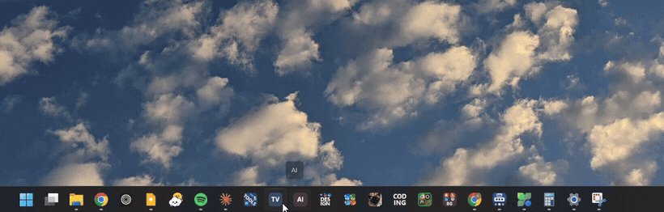

  One click on a group icon. Recorded on a real Windows 11 taskbar.

---

## What it is for

Windows 11 gives you one row for pinned apps and no folders. Pin everything you use and the row runs out of taskbar; pin only a few and the rest live in the Start menu, two clicks away.

This app puts them in groups. A group is one icon on your taskbar, and behind it is a small panel holding the apps you put in it. Nothing is replaced and nothing is patched: a group is an ordinary Windows shortcut with an icon of its own, so the taskbar treats it like any other pinned app.

---

## Every group gets a face

Templates and a free hand designer. These are real group icons off a real taskbar, composed at the size Windows asks for:

<table>
<tr>
<td align="center"></td>
<td align="center"></td>
<td align="center"></td>
<td align="center"></td>
<td align="center">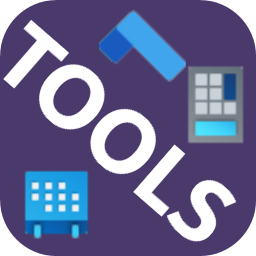</td>
<td align="center">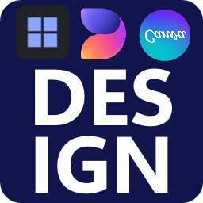</td>
<td align="center"></td>
</tr>
<tr>
<td align="center"><b>Text only</b></td>
<td align="center"><b>App grid</b></td>
<td align="center"><b>Grid plus text</b></td>
<td align="center"><b>Your image</b></td>
<td align="center"><b>Your own design</b></td>
<td align="center"><b>Your own design</b></td>
<td align="center"><b>Your own design</b></td>
</tr>
</table>

Seven real groups off one taskbar. Nothing here was drawn for the screenshot.

---

## What it does

<table>
<tr>
<td width="46%" valign="top">

### Live window previews

Hover an app that has windows open and you get a preview of each one, drawn by the same part of Windows the taskbar's own previews use. The title, the app's icon, and a close button on every one.

</td>
<td width="54%">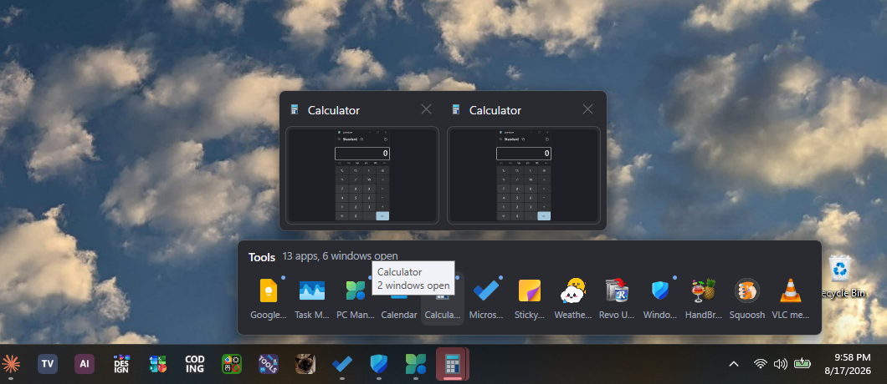</td>
</tr>

<tr>
<td width="46%">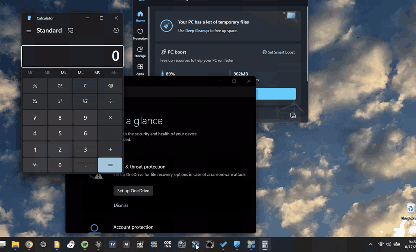</td>
<td width="54%" valign="top">

### Peek at the real window

Rest on a preview and the window itself comes forward, full size, in its own place, over everything else. Move away and it goes back exactly as it was. Nothing is activated and nothing is resized. Off until you switch it on.

</td>
</tr>

<tr>
<td width="46%" valign="top">

### Draw the icon yourself

A real editor: layers of text, shapes, app icons and pictures, dragged around, resized by their corners, turned by a handle, in any colour, at any weight. Sixty steps of undo, and the 16, 24, 32 and 48 pixel versions drawn underneath as you work.

</td>
<td width="54%">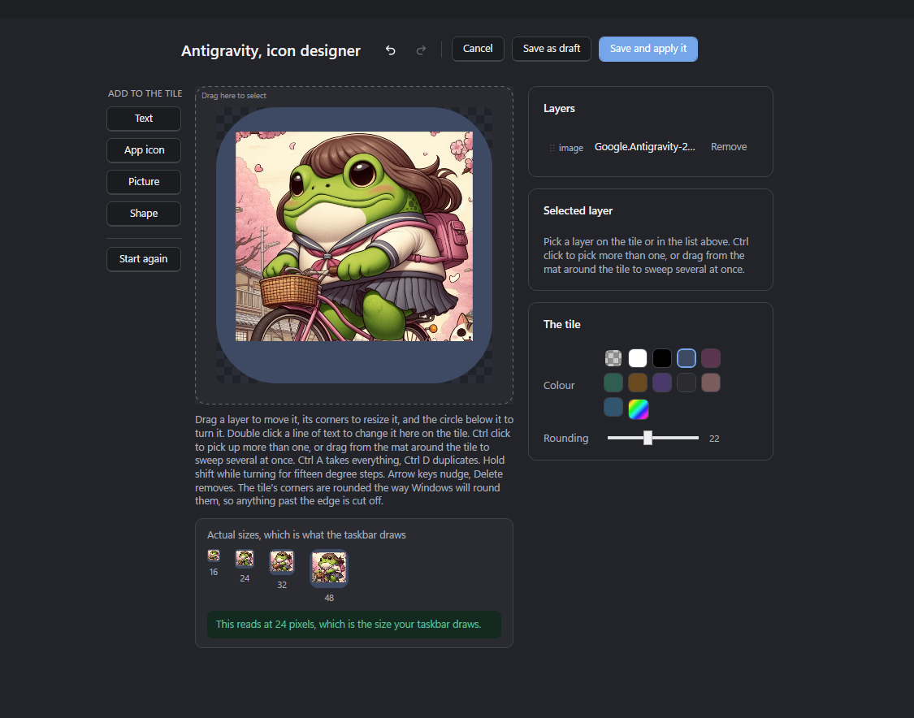</td>
</tr>

<tr>
<td width="46%">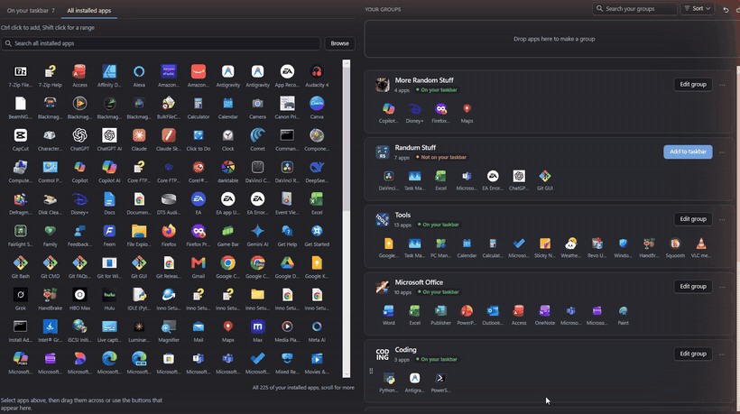</td>
<td width="54%" valign="top">

### It already knows what you have

Every app on your taskbar and every app installed on the machine, found for you and searchable, packaged apps and ordinary programs alike. Nothing to hunt down and no paths to type. Select what you want, with Ctrl or Shift for several at once, and drag them across. A run of apps lands in the order it was in, wherever you point it, and one drag is one press of Ctrl+Z.

</td>
</tr>

<tr>
<td width="46%" valign="top">

### Change any app's icon

The same designer will rewrite the icon of an app that is not in any group, so your Start menu and taskbar show your picture instead of theirs. It says up front which apps Windows will allow this for, and it can put the original back exactly.

</td>
<td width="54%">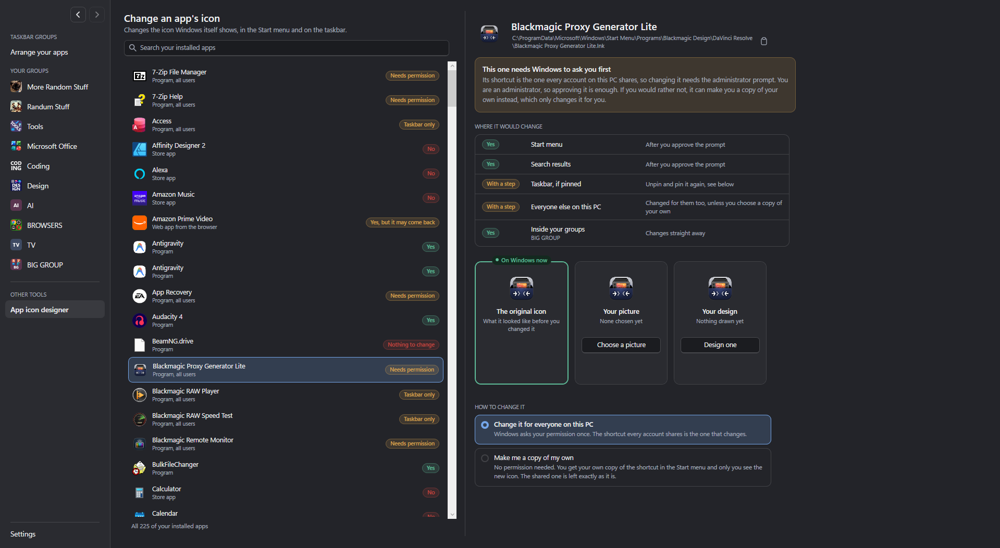</td>
</tr>

<tr>
<td width="46%">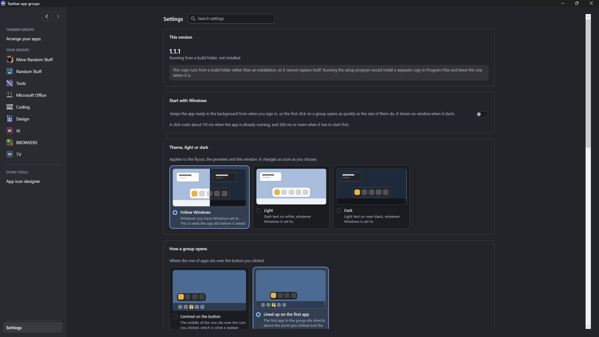</td>
<td width="54%" valign="top">

### Light, dark, and your call on everything

**There is a full light theme and a full dark one**, and it will follow Windows if you would rather not choose. Every screenshot on this page is the dark theme; the light one is the same app in daylight. Then: whether a flyout opens centred on its button or lined up on its first app, what the other previews do when you close one, whether it starts with Windows. Every setting shows you a picture of what it does rather than describing it.

</td>
</tr>
</table>

---

## Making your first group

**1. Drag some apps in.** Everything on your taskbar and everything installed, searchable. Drag them across, or use the button.

  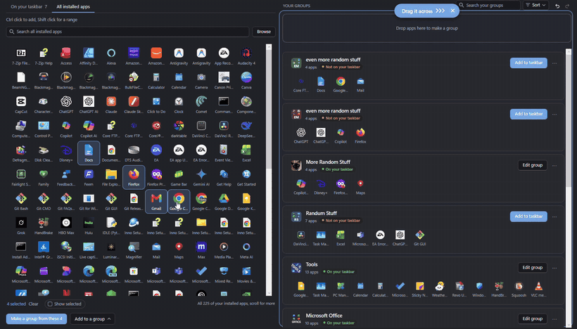

**2. Give it a face.** Pick a template, drop in a picture, or open the designer and draw one.

  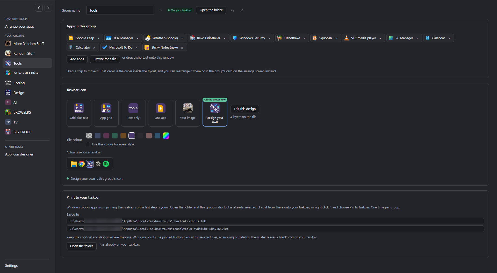

**3. Pin it.** Save, and the folder opens with your shortcut ready. **Drag it out of the folder and drop it on your taskbar**, where you want it to sit. Right click and **Pin to taskbar** works too, but the drag lets you choose the position.

  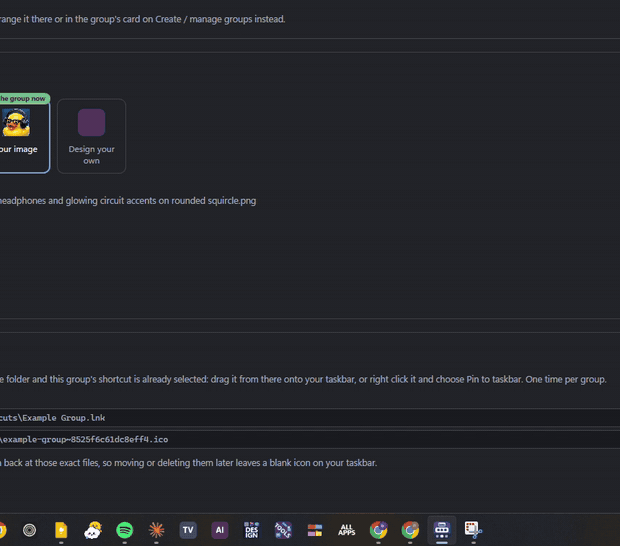

> [!WARNING]
> **One thing is by hand, and it has to be.** Windows 11 does not let any program pin or unpin a taskbar button, so the last step is yours: drag the group's shortcut onto your taskbar, then unpin the apps you have just grouped. The app names exactly which icons to remove and reminds you on the way out.

---

## Installing

1. Download `TaskbarAppGroupsSetup.exe` from the [latest release](../../releases/latest).
2. Run it. Choose **More info**, then **Run anyway**, see the note below.
3. The wizard asks whether to install for everybody or just you, and where. The defaults are for all users and `C:\Program Files\Taskbar App Groups`.

> [!NOTE]
> **Windows will warn you about this file.** It says "Windows protected your PC" because the installer is not signed by a paid certificate yet. That is a statement about the certificate and not about the file. Nothing else is bundled with it and nothing runs in the background unless you turn that on yourself.

> [!TIP]
> **Updates come from this page.** An installed copy looks here once a day and tells you when there is a newer one. It downloads and installs nothing until you press the button on its own settings screen.

### What it needs

- Windows 11, 64 bit. It runs on Windows 10 but the taskbar behaves differently and is untested.
- Nothing else. .NET is inside the installer.
- About 120 MB on disk once installed.

---

## Worth knowing before you download

Three of these are limits of the Windows 11 taskbar rather than of this app. They were each measured rather than assumed, and the app tells you about them in the moment instead of leaving you to work it out.

A pinned button keeps the picture it was pinned with

If you redraw a group's icon after pinning it, the taskbar goes on showing the old one. That is Explorer's own copy of the button, and nothing a program may do will shift it: rewriting the icon, the shortcut, the pinned copy and three different shell notifications were all tried on a real taskbar and photographed. Unpin and pin again, or sign out. The app says exactly this, at the moment it matters.

Pinning and unpinning is yours to do

No program can pin a taskbar button on Windows 11, so saving a group opens the folder with the shortcut already selected and you put it on the taskbar yourself, once. **Dragging it out of that folder and dropping it where you want it works well**, and it is the route worth knowing, because it also chooses the position. Right click and Pin to taskbar works too.

What does not work is a program handing the taskbar a shortcut from inside its own window. That was built, tried against a real taskbar and removed: Windows 11 ignores the drop, unlike Windows 10. So the folder is the way, and opening it for you is the most any app can do.

It is not a taskbar replacement

Nothing is injected into Explorer, no shell extension is registered, and the taskbar is not modified. A group is a shortcut with a composed icon, and the panel is an ordinary window this app draws above the taskbar. If you uninstall it, your taskbar is exactly as it was.

What it does with your data, which is nothing

No account, no telemetry, no analytics. Your groups live in one readable file under your own app data folder, and the only thing it ever sends is a request to this page asking what the newest version is. It does not start with Windows unless you switch that on.

Uninstalling takes its things with it

The uninstaller offers to remove your groups, the icons it composed and the shortcuts it wrote, and it puts back the icon of any other app you changed with it, which is the one leftover a general uninstaller could never fix. Say no and everything stays where it is.

---

  Built for Windows 11. Report a problem on the <a href="../../issues">issues page</a>, or read
  what changed in the <a href="../../releases">release notes</a>.

